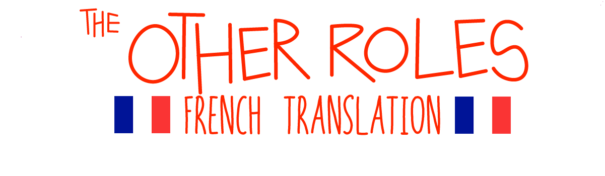

# TheOtherRoles - French Translation

Il s'agit d'une traduction française du plugin TheOtherRoles pour le jeu vidéo [Among Us](https://innersloth.com/gameAmongUs.php). Ce plugin ajoute de nouveaux rôles pour les joueurs, comme le Hacker et le Maire, ce qui permet de varier les parties et de les rendre plus intéressantes.

Cette traduction a été réalisée à partir du projet original disponible sur GitHub :  [TheOtherRoles](https://github.com/TheOtherRolesAU/TheOtherRoles). Nous remercions les développeurs pour leur travail et leur contribution à la communauté de joueurs d'Among Us.

## Installation

Pour installer cette traduction, vous pouvez télécharger le fichier `TheOtherRoles.dll` depuis ce lien : [Release](https://github.com/squareface27/AmongRoles-FrenchTranslation/releases/tag/Release-1.1). Ensuite, il vous suffit de le placer dans le dossier `BepInEx/plugins` du jeu.

ATTENTION : Veuillez noter que le mod présenté ici n'est pas compatible avec la version de base du mod. Par conséquent, si vous jouez avec cette version modifiée et que quelqu'un d'autre souhaite jouer avec vous en utilisant la version anglaise du mod, cette personne devra télécharger le mod en anglais disponible [Ici](https://github.com/squareface27/TheOtherRoles-CheckByPass), cette version permet de supprimer la vérification de version et donc rendre les deux versions compatibles. Pour l'installation il faut suivre les mêmes procédures d'installation que la version traduite.

## Contributions

Si vous souhaitez contribuer à cette traduction ou rapporter des problèmes, vous pouvez le faire en ouvrant une [issue](https://github.com/squareface27/AmongRoles-FrenchTranslation/issues) ou en proposant une [pull request](https://github.com/squareface27/AmongRoles-FrenchTranslation/pulls). Nous apprécions toute aide ou suggestion pour améliorer cette traduction et rendre le plugin accessible à tous les joueurs francophones.

## Licence

Ce projet est distribué sous la licence [GPL 3.0](https://github.com/squareface27/AmongRoles-FrenchTranslation/blob/master/LICENSE). Vous pouvez l'utiliser, le modifier et le distribuer librement, mais sans garantie ni support de notre part. Veuillez vous référer à la licence pour plus de détails.